# Architecture Diagrams — CTC Mobile Wishlist

Visual diagrams of the system architecture, data flows, navigation, and user journeys using Mermaid syntax.

---

## 1. System Architecture Overview

A layered view of the application showing how the Presentation Layer (screens), Navigation Layer (Expo Router and Context providers), and Data/Service Layer (services and AsyncStorage) are organized and connected.

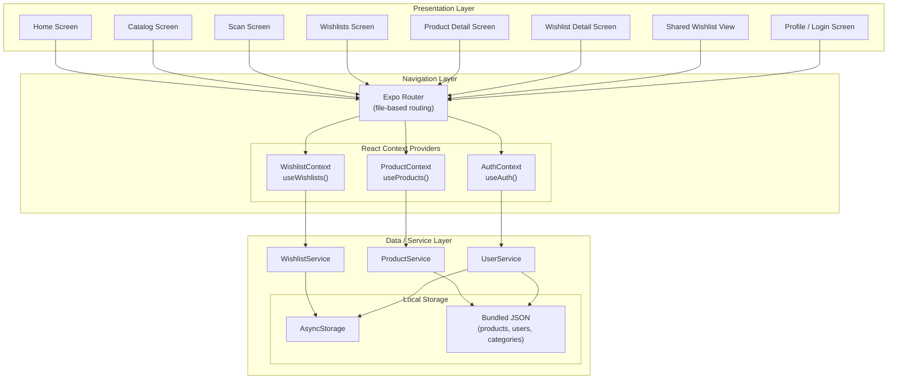

---

## 2. Data Flow Diagram

How data flows from user interactions through Context providers to services and ultimately to local storage, and how state updates propagate back to the UI.

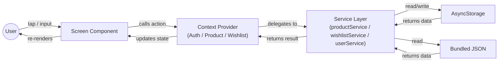

---

## 3. Navigation Flow

Screen-to-screen navigation paths through the app. The four main tabs are the primary entry points, with modal and stack screens accessible from each.

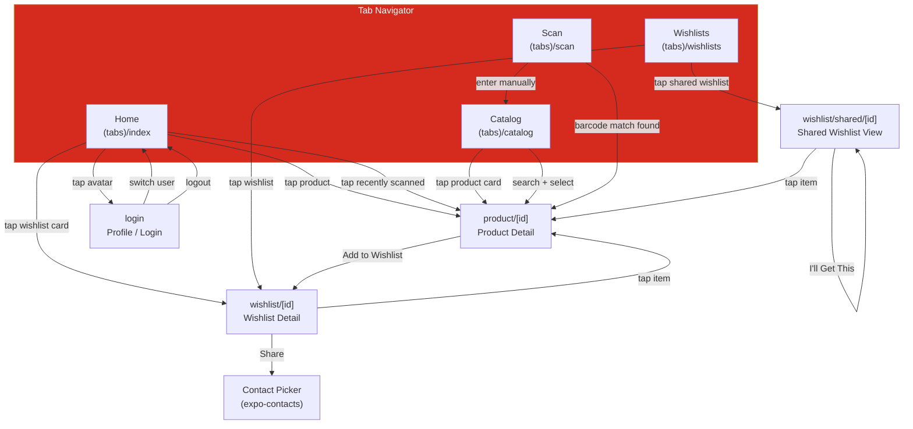

---

## 4. Service Layer Class Diagram

Interfaces for the three services that form the data access layer. All data operations go through these typed interfaces, allowing the implementation to be swapped from local storage to a real backend without changing screens or components.

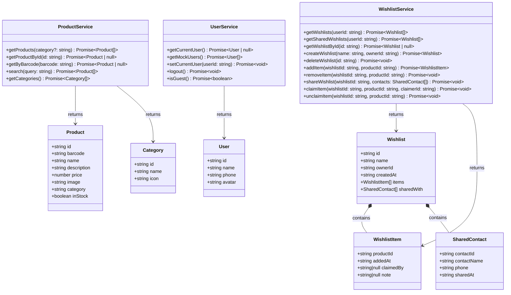

---

## 5. Context Provider Hierarchy

The nesting order of React Context providers around the application root. AuthProvider sits outermost so that user identity is available to all inner providers. WishlistProvider is innermost because it depends on both auth state and product data.

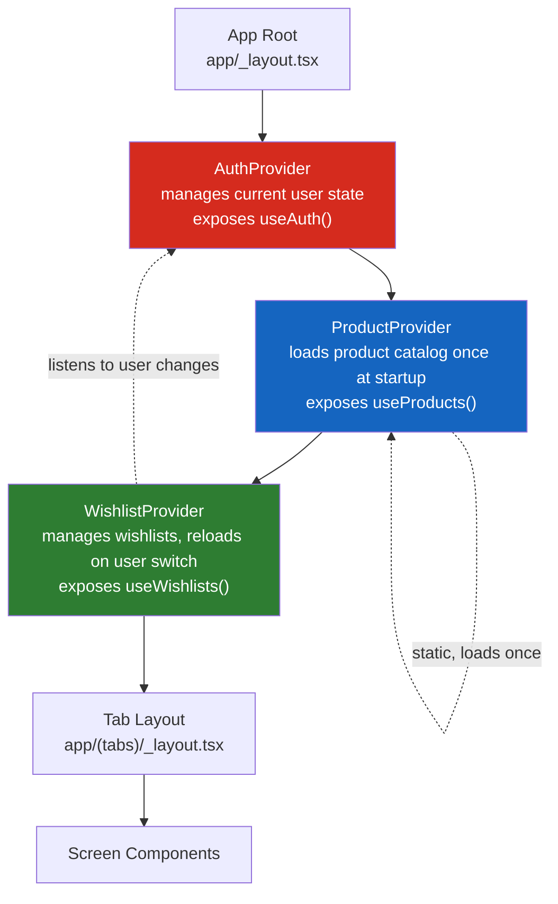

---

## 6. User Journey: Add to Wishlist

Sequence diagram showing two paths for adding a product to a wishlist: browsing the catalog and scanning a barcode. Both paths converge at the Product Detail screen where the user triggers the add action.

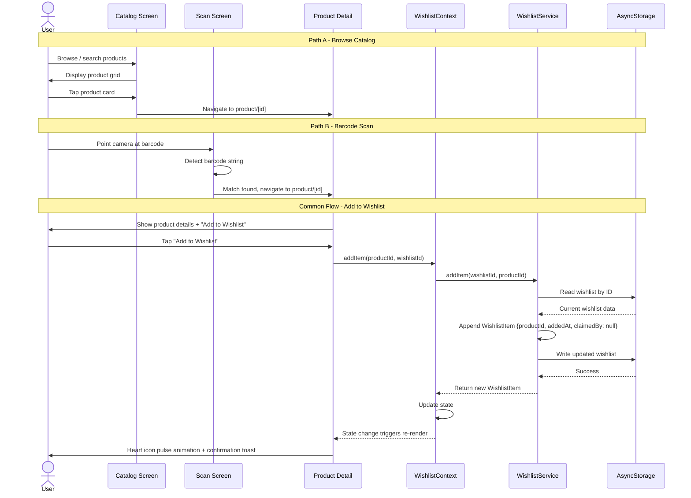

---

## 7. User Journey: Share & Fulfill

Sequence diagram for sharing a wishlist with contacts and a recipient viewing and claiming items from the shared wishlist.

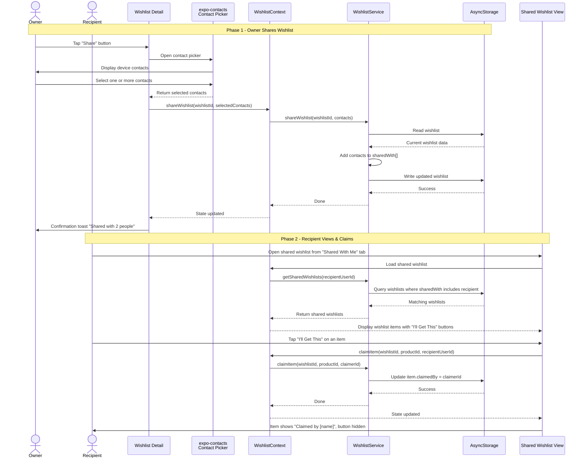

---

## 8. Component Hierarchy

Tree diagram of the key reusable UI components from the design system and how they compose within the main screen layouts.

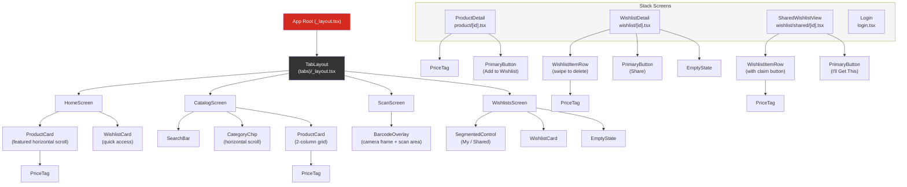

---

## 9. PR Creation & Review Workflow

How code moves from a dev agent's feature branch through Conductor's PR lifecycle, Lens code review, and CI verification before merging to `develop`.

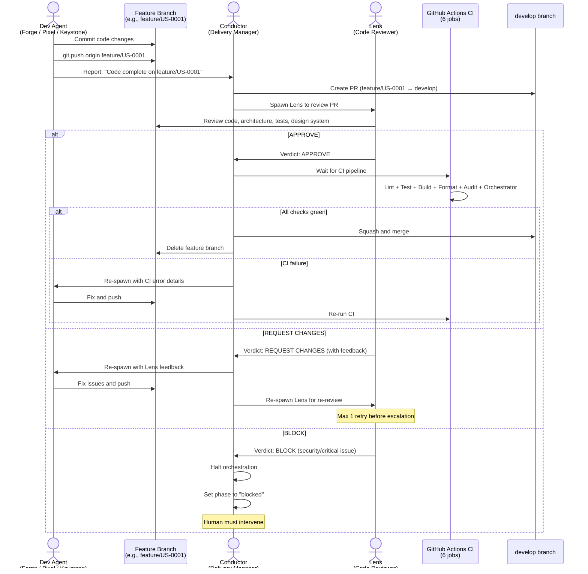

---

## 10. CI Pipeline Flow

The 6-job GitHub Actions CI pipeline that runs on every PR to `main` and `develop`. All jobs run in parallel; all must pass before merge.

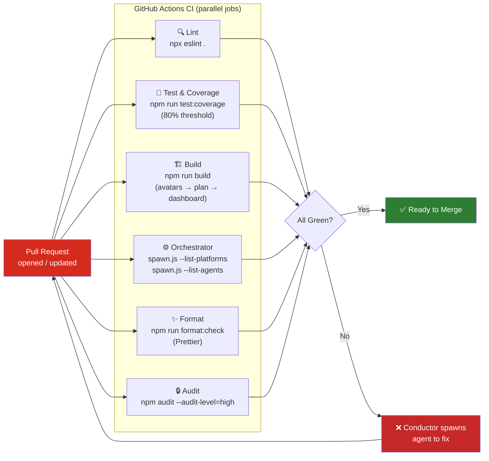

---

## 11. Agent Orchestration & Branch Strategy

How Conductor orchestrates agents across BLAST phases, showing branch creation, parallel work, Lens review gates, and merge points.

```mermaid
gitgraph
    commit id: "Initial setup"
    branch develop
    checkout develop
    commit id: "Project scaffold"

    branch feature/US-0001-expo-scaffold
    checkout feature/US-0001-expo-scaffold
    commit id: "Keystone: scaffold"
    commit id: "Keystone: types + services"
    checkout develop
    merge feature/US-0001-expo-scaffold id: "Lens APPROVE → merge" tag: "Phase 2 ✓"

    branch feature/US-0002-mock-data
    checkout feature/US-0002-mock-data
    commit id: "Forge: mock data + services"

    checkout develop
    branch feature/US-0003-catalog
    checkout feature/US-0003-catalog
    commit id: "Pixel: catalog + nav"

    checkout develop
    merge feature/US-0002-mock-data id: "Lens APPROVE → merge"
    merge feature/US-0003-catalog id: "Lens APPROVE → merge" tag: "Phase 3 ✓"

    branch feature/integration
    checkout feature/integration
    commit id: "Pixel: wire services to screens"
    checkout develop
    merge feature/integration id: "Lens APPROVE → merge" tag: "Phase 4 ✓"

    branch feature/tests
    checkout feature/tests
    commit id: "Circuit: Jest suites"
    commit id: "Sentinel: bug fixes"
    checkout develop
    merge feature/tests id: "Lens APPROVE → merge" tag: "Phase 5 ✓"

    commit id: "Phase 6: polish + demo prep"

    checkout main
    merge develop id: "Release v1.0.0" tag: "v1.0.0"
```

---

## 12. Concurrency Safety — Parallel Agent File Access

Shows how file-lock, atomic-write, and git-safe protect shared state when Forge and Pixel run simultaneously in Phase 3.

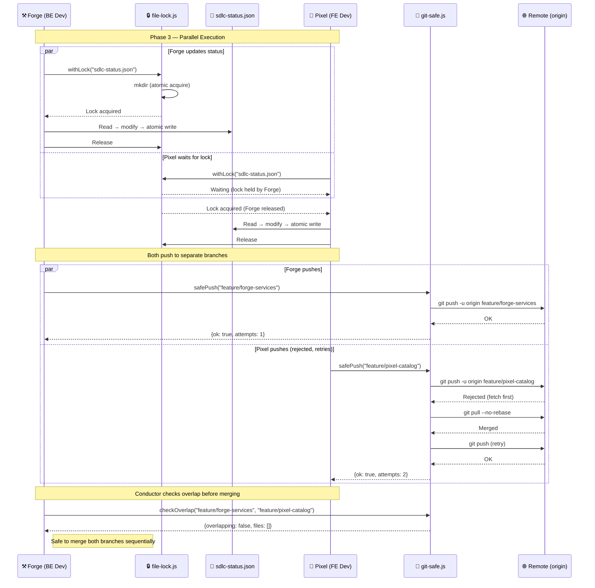

---

## 13. Pre-Commit Hook Flow

Shows how husky + lint-staged intercept `git commit` to auto-format and lint staged files before they reach CI.

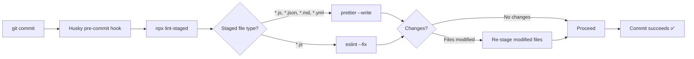
